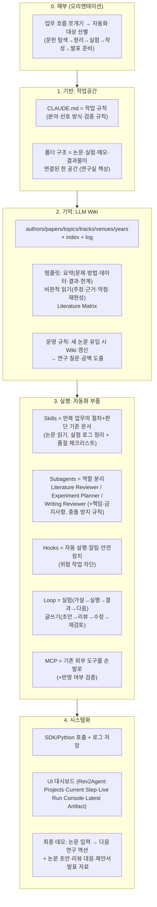

# 01 — 강의 캡처 24장 분석: 재배열·아키텍처 추출·모방 결정표

> 원본: "ai 연구 자동화 시스템 개발 강의 계획 흐름" 폴더의 IMG_9600–9624.jpg 24장 (IMG_9604 없음 — 촬영 시 결번, 결손 아님을 24장 완결 매핑으로 확인)
> 원본 이미지는 저작권·공개 노출 문제로 repo에 커밋하지 않음(사용자 보관). 본 문서의 텍스트 증거로 대조 가능.
> 강의 실체: 한국어 온라인 강의 플랫폼의 **강의 소개(랜딩) 페이지** 캡처 — 공학 분야 박사 강사의 "개인 연구 에이전트 제작" 강의. 캡처에 '공개 예정' 뱃지 다수 → 순차 공개형.

---

## 1. 페이지 구조와 재배열 방법

캡처는 세 종류의 페이지 요소로 판명:
- **마케팅 블록**: `STEP N.` 소개 박스, `Part NN |` 제목, `Phase N |` 레슨 소개, 데모 스크린샷
- **강사 Comment 박스**: 각 파트의 교육 의도 해설 (테마색: 주황=전반부 STEP 1·2, 파랑=후반부 STEP 3·4)
- **목차 아코디언(TOC)**: 실제 강의 단원(클립 수 명기) + 레슨 제목 리스트 — **순서의 최우선 근거**

재배열 신호 우선순위(계획대로): TOC 단원 구조 > STEP 박스 번호 > 테마색 군집 > Phase 내용의 개념 의존성. 결과: **24장 전부가 "도입 1장 + 8개 단원 × 3장(마케팅/코멘트/TOC)"으로 잔여 없이 매핑됨** — 이 완결성이 재배열의 자체 검증이다.

## 2. 재배열 증거표 (24행)

| 순서 | 강의 단원 | IMG | 캡처 내용 1줄 | 근거 | 신뢰도 |
|---|---|---|---|---|---|
| 0 | 도입 훅 | 9600 | "박사님의 연구 자동화 노하우" + 3약속(AI 연구 비서/LLM Wiki/반복 업무 자동화) | 남색 인트로 톤, 3약속=STEP 구조 예고 | H |
| 1-a | ①오리엔테이션·왜 에이전트인가 | 9601 | Part 01 "연구자는 왜 자기만의 AI 연구 에이전트를 가져야 하는가" + WORKFLOW 5각형(문헌 탐색→정리→실험→작성→발표 준비) + Phase 2 "내 연구 워크플로우를 에이전트 관점으로 해부하기" | Phase 제목이 TOC ①의 레슨과 일치 | H |
| 1-b | ① | 9616 | TOC: 오리엔테이션(강의 목표: 개인 연구 에이전트·CLAUDE.md·Skills·Subagents·LLM Wiki)/Rev2Agent 데모(부품: UI·Agent Loop·Skills·Subagents·MCP)/워크플로우 해부(하루를 업무 흐름으로 쪼개기, 자동화할 업무와 직접 할 업무 구분) | TOC 원문 | H |
| 2-a | ②Claude Code 작업공간 | 9602 | Part 02 "Claude Code로 내 연구 프로젝트 작업공간 만들기" + CLAUDE.md 폴더 일러스트 + Phase 2 "연구용 CLAUDE.md 작성하기" | TOC ②와 일치 | H |
| 2-b | ② | 9607 | 강사 Comment: 연구 주제/논문 폴더/실험 기록/원고가 **한 공간에서 연결**되는 구조 = "연구실 책상" = 이후 모든 자동화의 기반 | 주황(전반부), 작업공간 주제 | H |
| 2-c | ② | 9617 | TOC: Claude Code를 작업공간으로 이해/첫 프로젝트 협업/CLAUDE.md가 작업 규칙이 되는 이유/내 분야·선호 방식 적기/**검증 규칙 추가**/논문·실험·메모·결과물 폴더 구조/샘플 넣고 컨텍스트 확인 | TOC 원문 | H |
| 3-a | ③LLM Wiki (STEP 2) | 9603 | STEP 2 박스(읽을수록 축적, 연구 질문·공백 도출) + Part 01 "논문을 읽고 축적되는 LLM Wiki 만들기" + **Obsidian 그래프뷰**(authors/papers/topics/tracks/venues/years/index/log) | STEP 번호 명시 | H |
| 3-b | ③ | 9624 | 같은 Part + Obsidian topic 페이지(Topic Synthesis·Common Methods·논문 링크) + Phase 2 "논문 요약, 비교, 비판적 읽기 템플릿 설계" | 데모=Wiki 실물 | H |
| 3-c | ③ | 9618 | TOC: 일회성 요약→축적형 지식/Wiki 폴더·문서 템플릿/요약 템플릿(문제·방법·데이터·결과·한계)/비판적 읽기 템플릿(주장·근거·약점·재현 가능성)/샘플로 Wiki 페이지 생성/**Literature Matrix**/연구 질문·공백 뽑는 질문법/새 논문 유입 시 Wiki 업데이트 **운영 규칙** | TOC 원문 | H |
| 4-a | ④Skills (STEP 3 시작) | 9605 | STEP 3 박스(Skills·Subagents·Hooks·MCP로 논문 읽기~실험~글쓰기 자동화) + Part 01 + Claude Code 데모(research_state.json, phase5_experiment_log.md, INDEX.md, research_roadmap.md, 가설 H1~H3 확인) | STEP 번호 명시 | H(박스)/M(Part 제목 배속*) |
| 4-b | ④ | 9606 | Phase 2 "실험 로그/결과 정리 Skill과 품질 규칙 만들기" + 강사 Comment: **"Skill은 단순 프롬프트가 아니라 작업 절차와 판단 기준을 문서화한 실행 지침"** | TOC ④ 레슨과 일치 | H |
| 4-c | ④ | 9619 | TOC [8클립]: Skill은 프롬프트 모음이 아니라 반복 업무의 작업 절차/어떤 업무를 Skill로 만들면 좋은가/논문 읽기 Skill(입출력 설계→SKILL.md에 절차·기준→실행 후 다듬기)/실험 로그 정리 Skill/결과 표·실패 원인·다음 실험 제안 출력/**Skill 품질 체크리스트** | TOC 원문 | H |
| 5-a | ⑤Subagents | 9608 | Part 02 + 데모 "Phase 4 — Experiment Design (core_audit)"(데이터 소스 고정, Feature Provenance Tier 0-3, Regime C/S/L) + Phase 2 "Experiment Planner와 Writing Reviewer Agent 만들기" | Phase 제목이 TOC ⑤와 일치 | H(내용)/M(Part 제목 배속*) |
| 5-b | ⑤ | 9609 | 강사 Comment: 하나의 AI에 다 맡기지 않고 **문헌 검토자·실험 설계자·비판적 리뷰어·글쓰기 보조자** 역할 분리, 결과물 품질 점검 흐름 | Subagents 주제 | H |
| 5-c | ⑤ | 9620 | TOC [8클립]: Subagent는 역할을 나누는 방법/내 프로젝트에 필요한 역할 정의/Literature Reviewer(**책임과 금지사항 설계**, LLM Wiki 참고 문헌 리뷰, 결과 평가·보완 지시)/Experiment Planner(다음 실험 후보)/Writing Reviewer(초안의 논리·근거 점검)/**역할 충돌을 줄이는 운영 규칙** | TOC 원문 | H |
| 6-a | ⑥Hooks·Loop·MCP | 9610 | Part 03 "Hooks, Loop, MCP로 연구 에이전트 운영하기" + **LOOP 다이어그램(읽기→실행→평가→수정)** + Phase 2 "연구 Loop 설계" | TOC ⑥과 제목 일치 | H |
| 6-b | ⑥ | 9611 | 강사 Comment: Hooks=작업 전후 자동 실행 규칙, Loop=반복적으로 좋아져야 하는 과정 설계, MCP=이미 쓰는 외부 환경을 에이전트 안으로. **"Claude를 단순 대화창이 아니라 연구 워크플로우의 중심 도구로"** | 주제 일치 | H |
| 6-c | ⑥ | 9621 | TOC [9클립]: Hooks(자동 실행·알림·**안전장치**, 논문 추가·실험 결과 저장·**위험 작업 차단** 시나리오, Hook 규칙 설계)/연구 Loop(Agent Loop 이해, **실험 Loop: 가설·실행·결과·다음 실험**, **글쓰기 Loop: 초안·리뷰·수정·재검토**)/MCP(외부 도구를 손발로, 문헌·파일·노트·데이터 연결 시나리오, **연결 데이터가 답변에 반영되는지 확인**) | TOC 원문 | H |
| 7-a | ⑦SDK/Python·UI (STEP 4) | 9612 | STEP 4 박스(에이전트를 시각적으로 보는 사이트 완성, 논문 작성~발표 준비 연결) + Part 01 "Claude Code SDK/Python으로 연구 에이전트 확장하기" + **Rev2Agent 웹 대시보드 데모**(Projects/Current Step 사이드바, Live Run Console, Latest Artifact round_summary.md) | STEP 번호 명시 | H |
| 7-b | ⑦ | 9613 | Phase 2 "Agent 구조 해부: UI와 에이전트 루프가 연결" + 강사 Comment: SDK+Python, 강사 템플릿 기반, 에이전트를 Python에서 호출, UI·자동 실행 흐름 연결, **개인 작업공간을 넘어 도구·서비스 형태로** | TOC ⑦과 일치 | H |
| 7-c | ⑦ | 9622 | TOC [8클립]: SDK를 쓰면 무엇이 달라지는가/Python 호출 전체 흐름/SDK 템플릿 프로젝트 구조/Python 템플릿으로 실행/프롬프트·연구 컨텍스트 전달/**실행 결과와 로그 저장 방식**/Rev2Agent 구조 해부(UI·Python·SDK·연구 프로젝트)/UI를 붙일 때의 설계 원칙 | TOC 원문 | H |
| 8-a | ⑧완성·연결·마무리 | 9614 | Part 02 + 논문 Figure 데모(모델·Regime별 정확도 차트) + Phase 2 "논문 작성, 리뷰 대응, 연구 제안서 작성에 연결하기" | TOC ⑧과 일치 | H |
| 8-b | ⑧ | 9615 | 강사 Comment: **앞에서 만든 구성요소들을 하나로 묶어 개인 연구 에이전트 완성**, 논문 초안·제안서·발표 자료 전환, **운영 기준과 확장 방향** 제시 | 마무리 톤 | H |
| 8-c | ⑧ | 9623 | TOC [8클립]: 구성 요소 묶기(**최종 점검: CLAUDE.md, LLM Wiki, Skills, Subagents, Hooks, MCP**)/실행 시나리오 만들기/**최종 데모: 논문 입력부터 다음 연구 액션까지**/논문 초안·Related Work/리뷰 대응·연구 제안서/Claude Chat·Projects로 발표 자료/마무리: **"AI와 함께 연구하는 연구자가 된다는 것 — 내 연구 에이전트를 계속 키워가는 법"** | TOC 원문 | H |

\* **모호성 정직 표기**: 마케팅 블록의 `Part 01/02` 제목("연구자는 왜…", "…작업공간 만들기")이 전반부(주황)와 후반부(파랑)에 **중복 등장**한다(9601↔9605, 9602↔9608·9614). 랜딩 페이지가 Part 제목 프레임을 STEP 구간마다 재사용한 것으로 판단. **단원 배속은 Phase 제목·데모 내용·TOC 대조로 확정**했으므로 추출 결과에는 영향 없음. 유일한 잔여 불확실성은 "마케팅 블록이 페이지에서 몇 번째 위치였는가"라는 지엽적 문제뿐.

## 3. 강의가 가르치는 시스템 (추출 아키텍처)

**한 문장**: 연구자의 반복 업무를 에이전트 관점으로 해부한 뒤, `CLAUDE.md(규칙) + 폴더 구조(공간) + LLM Wiki(기억) + Skills(절차) + Subagents(역할) + Hooks(안전) + Loop(개선) + MCP(연결)`를 조립해 **UI가 달린 개인 연구 에이전트**로 완성하고, "논문 입력→다음 연구 액션"까지 한 사이클을 자동화한다.

**강의의 운영 철학 (원문 근거)**:
1. "Skill은 단순 프롬프트가 아니라 **작업 절차와 판단 기준을 문서화한 실행 지침**" (9606)
2. "하나의 AI에게 모든 일을 맡기는 대신 **역할을 나눈** Subagents" + "역할 **충돌을 줄이는 운영 규칙**" (9609·9620)
3. Hooks의 3역할 = 자동 실행·알림·**안전장치(위험 작업 차단)** (9621)
4. "**반복적으로 좋아져야 하는** 연구 과정"을 Loop로 설계 (9611)
5. MCP: "연구자가 **이미 쓰고 있는 환경**을 에이전트 안으로" + "연결된 데이터가 답변에 반영되는지 **확인**" (9611·9621)
6. 자동화 전에 **"자동화할 업무와 직접 해야 할 업무 구분"** (9616)
7. 완성 후에도 "**계속 키워가는 법**(운영 기준·확장 방향)" (9615·9623)

## 4. 모방 결정표 — 강의 요소 → 사용자(Nuri Kim) 시스템

사용자는 이 강의의 최종 형태(STEP 4: UI 대시보드+화이트리스트 실행)를 **이미 선구현**했다(AI Company 대시보드+디스패처). 따라서 과제는 "모방"이 아니라 **중간 계층(STEP 2·3의 기억·절차·안전 부품)의 완성**이다. 결정: ✅채택(신규 도입) / 🔄변형(기존 확장) / ⏸보류(근거 명시).

| 강의 요소 | 기존 대응물 (실측) | 결정 | 적용 방향 (상세는 02) |
|---|---|---|---|
| 업무 해부(자동화 대상 선별) | 화이트리스트 12액션(암묵적 해부 결과) | 🔄 | 3필러(연구·사역·사업)별 업무 해부표를 명문화 — 화이트리스트의 근거 문서가 됨 |
| 연구용 CLAUDE.md(규칙+검증 규칙) | 전역 CLAUDE.md(Drive)만 존재, repo용 없음(F-06) | ✅ | repo CLAUDE.md 신설(FIX-06) + **검증 규칙** 개념 도입(강의 고유: "좋은 응답을 만들기 위한 검증 규칙") |
| 폴더 구조(한 공간 연결) | Dropbox Claude Dropbox/(00_inbox·★Current Readings·Church event), AI Company/ | 🔄 | 현행 유지 + 경로 표준화(FIX-08/09)로 멀티디바이스 이식성 확보 |
| LLM Wiki(축적형 기억) | Obsidian "LLM WIKI" 볼트 존재(team-room.html:331), research.wiki "위키 소급" 액션 존재 — **템플릿·운영 규칙은 미확인(UNVERIFIED)** | ✅ | 구약학 맞춤 템플릿 제작: 요약(본문·논지·방법론·전거·한계), 비판적 읽기(주장·근거·약점·재현성→**주석가 계보·본문비평 단서** 추가), Literature Matrix, 새 문헌 유입 시 갱신 규칙. lm-batch 산출물(NotebookLM 보고서)이 Wiki로 흘러들어가는 연결 신설 |
| 연구 질문·공백 도출 | 없음 | ✅ | Wiki 축적분에서 정기적으로 질문·공백 리포트 생성(정기 회차 편입 후보) |
| Skills(절차+기준+품질 체크리스트) | 커스텀 스킬 12종(이미 강의 수준 초과 실전 운용) — 단 품질 체크리스트·버전관리 없음(F-15) | 🔄 | 스킬 원본 repo 편입(FIX-15) + 강의의 **Skill 품질 체크리스트**를 12종에 소급 적용(입출력 명세·판단 기준·실패 처리 명시 여부 점검) |
| Subagents(역할 분리+책임·금지사항+충돌 방지) | church-orchestration(목회자→부장→총무·디자인·찬양→리스크 관리자 — 이미 동형 구조!), AI Company 팀 구조(연구·개발·사업·사역·비서) | 🔄 | 각 팀/역할에 **책임·금지사항 명세** 추가(강의 고유). 연구 필러에 Literature Reviewer·Writing Reviewer 역할 신설(ministry.research 완성과 연동, F-02) |
| Hooks(자동 실행·알림·안전장치) | 안전 보류 관례("커밋·금전·삭제는 사용자 실행") — UI 문자열로만 존재 | ✅ | 규약 명문화(FIX-06·07) + 디스패처에 하트비트 알림(FIX-11)·위험 작업 차단 목록 추가 |
| Loop(실험·글쓰기 반복 개선) | 정기 회차(04/18/23)는 스케줄 반복이지 **개선 Loop 아님** | ✅ | **글쓰기 Loop를 설교·논문에 적용**(초안→리뷰(Writing Reviewer)→수정→재검토), 실험 Loop를 개발 필러(dev.implement→run-verify)에 명시적 배선 |
| MCP(기존 환경 연결+반영 검증) | 커넥터 10종(이미 강의 수준 초과) | 🔄 | 유지 + "연결 데이터 반영 확인" 검증 습관을 킥오프·검수 프로토콜에 내장 |
| SDK/Python+UI | **이미 초과 달성**(대시보드 3장+Gist+디스패처, 강사의 Rev2Agent와 동형) | 🔄 | 신규 구축 불필요. 강의에서 가져올 것: **실행 결과·로그 저장 방식**의 체계화(worklog 표준 스키마), Current Step/Latest Artifact 개념(진행 중 작업 가시화) |
| 최종 데모 시나리오 | 없음(승인 테스트 부재) | ✅ | "입력→다음 액션" 종단 시나리오를 필러별 1개씩 승인 테스트로 채택(02의 최종 수용 기준) |
| 계속 키워가는 법(운영 기준·확장 방향) | 없음 | ✅ | 02의 운영 규약 장(월간 점검 회차: 감사 재실행·스킬 체크리스트 재적용) |
| Claude Chat/Projects 발표 자료 | Canva·pptx 스킬 보유 | 🔄 | 연구 결과→발표 초안 흐름을 pptx/Canva 스킬로 배선(선택 과제) |

**보류(⏸) 항목**: SDK/Python 직접 재구현(대시보드가 이미 그 역할 — 이중 투자), 강사 제공 템플릿 구매 의존 항목(내용 미공개 클립 다수 — 공개 후 재평가 가능).

## 5. 02(마스터플랜)로 넘기는 핵심 입력

1. 빌드 우선순위 논리: **기반 수리(FIX) → 기억 계층(LLM Wiki 정식화) → 절차·역할 계층(Skill 체크리스트·Subagent 명세) → Loop 배선 → 종단 데모** — 강의의 조립 순서와 동일한 위상 정렬.
2. 3필러 동형성: 강의(연구) ↔ 사역(church-orchestration=Subagents, 설교=글쓰기 Loop) ↔ 사업(dev.verify=실험 Loop) — 같은 부품을 필러별로 재사용(확장성의 근거).
3. 사용자의 진짜 공백은 STEP 2(기억)와 STEP 3의 운영 규칙(품질·안전·충돌 방지) — STEP 4는 완료, STEP 1은 수리(FIX-06/07)로 충족.
