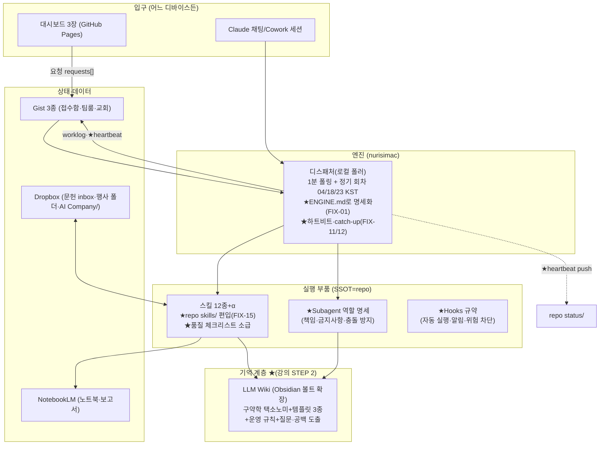

# 02 — 마스터 계획서: 연구·사역·사업 자동화 시스템 확장 빌드

> 소비자: 사용자(승인), **Sonnet 5 빌더**(실행, `03-kickoff-sonnet5.md`로 기동), **Opus 4.8 검수자**(`04-kickoff-opus48.md`로 기동)
> 입력: `01-lecture-analysis.md`(강의 추출·모방 결정표) · `05-audit-report.md`(발견 F-01~15) · `06-fix-commands.md`(수리 명령)
> 기록: 빌더는 `07-execution-ledger.md`, 검수자는 `08-inspection-log.md`에만 쓴다(단일 기록자 원칙).

---

## 0. 설계 요약

**목표**: 강의가 가르치는 "개인 연구 에이전트" 조립 순서를 따라, 이미 선구현된 AI Company 시스템(대시보드+디스패처+스킬 12종)에 **빠져 있는 중간 계층**을 채워 넣는다 — 기억(LLM Wiki), 절차 품질(Skill 체크리스트), 역할 명세(Subagent 책임·금지사항), 안전(Hooks), 개선 루프(Loop) — 그리고 이를 **연구·사역·사업 3필러에 같은 부품으로** 배선해 확장성을 확보한다.

**멀티디바이스 원칙(SSOT)**: 규약·스킬 원본·명세의 단일 진실원은 **이 repo**(버전관리·전 디바이스 접근 가능). nurisimac은 "실행 지점"(디스패처·로컬 파일·Chrome). Drive `Claude Cowork GD`는 Cowork 동기화 지점. Dropbox는 데이터 저장(문헌·행사 파일). 새 디바이스 추가 = repo clone + `devices/` 프로파일 적용.

**목표 아키텍처** (신규 부품은 ★):

**3필러 동형 배선** (같은 부품, 다른 도메인 — 확장성의 실체):

| 부품(강의 유래) | 연구(구약학) | 사역(희성교회 청소년부) | 사업(Hubrary·VoiceReading) |
|---|---|---|---|
| 파이프라인 Skill | lm-batch(-reports) 기존 | church-orchestration 기존 | dev.implement/verify 기존 |
| 기억(Wiki) | ★LLM Wiki 본격화 | 행사 아카이브→차기 행사 참조(기존 폴더 활용) | 출시 체크·리서치 축적(worklog) |
| Subagent 역할 | ★Literature Reviewer·Writing Reviewer | 기존 6역할(목회자→부장→3팀→리스크)에 ★책임·금지사항 명세 | 기존 dev/biz 역할에 동일 명세 |
| 글쓰기 Loop | ★논문: 초안→리뷰→수정→재검토 | ★설교: 본문→초안→리뷰→수정 | (해당 시) 출시 문안 |
| 실험 Loop | 가설→문헌 검증→다음 질문 | 행사 기획→리스크 점검→보완(기존 관례 명문화) | ★dev.implement→run-verify→다음 구현 |
| 안전(Hooks) | ★위험 작업 차단 목록 공통 + 필러별 보류 기준(커밋·금전·삭제·외부 발송) | | |

---

## 1. 빌드 단계

표기: `[선행]` 의존 단계 · `[태그]` `[REMOTE-OK]`원격 가능/`[IMAC-ONLY]`nurisimac 필요/`[ANY]`/`[USER]`사용자 손 필요 · **수용 기준**은 관찰 가능한 출력으로만. 각 단계 완료 시 원장(07)에 [상태·커밋 SHA·증거]를 기록하고 단계 ID 접두 커밋(`P2-S1: …`)을 남긴다. force-push 금지.

### P0 — 기동 (빌더 세션 시작 직후)
- **P0-S1 능력 프로브** `[ANY]`: `git remote -v && git branch --show-current`, `date`, GitHub MCP `get_me`, Drive 읽기 1회, Dropbox 도구 1회(승인 여부 기록), Gist 접근 1회(403 예상). 결과를 07 "프로브" 절에 붙여넣기 → 이번 세션에서 실행 가능한 태그 판정.
  - 수용: 07에 프로브 결과 존재. 실패 대안: 도구 자체가 없으면 그 사실을 기록하고 해당 태그 작업은 큐로.

### P1 — 기반 수리 (감사 대응) → **게이트 G1**
- **P1-S1 자율권 규칙(FIX-07)** `[IMAC-ONLY]`+repo측 `[REMOTE-OK]` — **최우선**: 이 규칙이 빌더 자신의 자율 실행 근거.
- **P1-S2 repo CLAUDE.md(FIX-06)** `[REMOTE-OK]` [선행 없음]
- **P1-S3 엔진 명세(V-01→FIX-01)** `[IMAC-ONLY]`
- **P1-S4 스킬 원본 수집(FIX-15)** `[IMAC-ONLY]` → repo `skills/`
- **P1-S5 경로 표준화(FIX-08/09)** `[IMAC-ONLY]` [선행 P1-S4 권장 — 스킬 본문 경로도 함께]
- **P1-S6 하트비트·catch-up(FIX-11/12)** `[IMAC-ONLY]` [선행 P1-S3]
- **P1-S7 잔여 검증(V-02·03·04·05, FIX-13)** `[IMAC-ONLY]`/`[USER]`
- **G1 판정(Opus)**: P1-S1·S2 **필수 PASS**. S3~S7은 iMac 가용성에 따라 blocked-handoff 허용(조건부 통과) — 단 큐가 비기 전 P4-S4(디스패처 지시문 수정 필요 단계)는 착수 금지.
- 예상 병목: iMac 세션 확보 지연 → 대안: 원격 가능한 S2와 P2 전체를 먼저 진행(의존성 없음).

### P2 — 기억 계층: LLM Wiki (강의 STEP 2 이식)
- **P2-S1 Wiki 구조 확정** `[IMAC-ONLY]`(볼트가 iMac에 있음): 기본안 = **기존 Obsidian "LLM WIKI" 볼트 확장**(C2 중단으로 기본안 채택 — 대안: Dropbox 마크다운 폴더/볼트를 동기화 위치로 이전. 전환 비용은 폴더 이동+링크 재확인 수준이므로 사용자가 PR 리뷰에서 변경 지시 가능). 구약학 택소노미: `authors/ works/ topics/ passages/ venues/ years/ + index.md + log.md` — 강의 구조에 **passages(성경 본문별 축)** 추가가 핵심 변형.
  - 수용: 볼트에 폴더 스캐폴드+index.md 존재(스크린샷 or ls 출력).
- **P2-S2 템플릿 3종** `[ANY]`(작성은 원격 가능, 배치는 iMac): ①요약(본문·논지·방법론·전거·한계) ②비판적 읽기(주장·근거·약점·재현 가능성 + 주석 전통·본문비평 단서) ③Literature Matrix(논문×축 비교표). repo `wiki-templates/`에 원본, 볼트에 사본.
  - 수용: 템플릿 3파일 repo 커밋 + 샘플 1건씩 작성 예시 포함.
- **P2-S3 파이프라인→Wiki 연결** `[IMAC-ONLY]` [선행 P2-S1·S2, P1-S4]: lm-batch(-reports) 마지막 단계에 "보고서→Wiki 페이지 생성(요약 템플릿 적용)+index 갱신" 추가(스킬 수정 — 백업·체크리스트 준수). 대시보드 `research.wiki`("위키 소급") 액션의 실제 스킬 매핑을 ENGINE.md에 명기.
  - 수용: PDF 1편 배치 실행 → 볼트에 새 페이지+index 갱신 확인.
  - 실패 대안: 스킬 수정이 2회 실패하면(전역 규칙) Wiki 생성을 별도 후처리 스킬로 분리해 회차에 추가.
- **P2-S4 질문·공백 도출** `[ANY]` [선행 P2-S3]: "여러 논문 연결→연구 질문·공백" 질문법을 스킬화(wiki-questions), 주간 회차 산출물로 `research-questions-YYYYMMDD.md` 생성.
  - 수용: 축적 문헌 ≥3편에서 질문 리포트 1개 생성.

### P3 — 절차·역할 계층 (강의 STEP 3 이식)
- **P3-S1 Skill 품질 체크리스트** `[ANY]` [선행 P1-S4]: 체크리스트 제정(트리거 명확성/입출력 명세/판단 기준/실패 처리/환경 게이트/멱등성/개인정보) → 12종+α 소급 점검표 작성 → 미비 항목 수정(백업 후, 심각한 것부터).
  - 수용: `skills/QUALITY-CHECKLIST.md` + 점검표(스킬×항목 매트릭스) + 수정 커밋들.
- **P3-S2 쌍둥이 단일화(FIX-10)** `[IMAC-ONLY]`+`[USER]` [선행 P3-S1]
- **P3-S3 Subagent 역할 명세** `[ANY]`: `roles/` 폴더에 팀 5역할(연구·개발·사업·사역·비서)+교회 6역할의 **책임·금지사항·산출물·충돌 방지 규칙**(강의 ⑤ 이식). church-orchestration과 대시보드 문자열의 기존 역할 정의를 출발점으로.
  - 수용: 역할 명세 파일 존재 + church-orchestration 스킬이 명세를 참조하도록 1줄 연결(스킬 수정은 백업 후).
- **P3-S4 연구 Subagents 신설** `[ANY]` [선행 P2, P3-S3]: Literature Reviewer(LLM Wiki 참조해 문헌 리뷰, 책임: 근거 인용/금지: 원문 없는 단정), Writing Reviewer(초안의 논리·근거 점검). 스킬 형태로 제작(skill-creator 규격) → claude.ai 업로드는 `[USER]` 단계.
  - 수용: 스킬 2종 repo에 존재 + 샘플 입력으로 드라이런 출력 1건씩.
- **P3-S5 Hooks 규약** `[ANY]` [선행 P1-S3]: 위험 작업 차단 목록(삭제·금전·외부 발송·대량 덮어쓰기), 알림 규칙(실패 시 하트비트에 표기), 자동 실행 지점(문헌 유입→배치, 회차 종료→하트비트)을 `ops/HOOKS.md`로 명문화하고 디스패처 지시문에 반영 `[IMAC-ONLY]`.
  - 수용: 문서 존재 + 지시문 diff.

### P4 — Loop 배선 (강의 Loop 개념의 3필러 적용)
- **P4-S1 설교 글쓰기 Loop** `[ANY]`: 본문 확정→초안→Writing Reviewer 리뷰→수정→재검토 흐름을 스킬(sermon-loop)로. 산출물은 Dropbox 사역 폴더(경로는 FIX-09 표준). 주간 리듬(설교 준비 요일)에 맞춘 회차 옵션은 사용자 결정 대기.
  - 수용: 샘플 본문 1개로 Loop 1사이클 산출물 4종(초안·리뷰·수정본·점검 기록).
- **P4-S2 논문 글쓰기 Loop** `[ANY]` [선행 P3-S4]: 동일 부품을 연구 원고에 적용(Writing Reviewer 공유 — 동형성 실증).
- **P4-S3 개발 실험 Loop 명문화** `[REMOTE-OK]` [선행 P1-S3]: dev.implement→run-verify→결과 기록→다음 구현 제안을 ENGINE.md 매핑표+worklog 표준 스키마(강의 ⑦ "실행 결과와 로그 저장 방식")로.
- **P4-S4 ministry.research 완성(F-02)** `[IMAC-ONLY]` [선행 P3-S4, G1 큐 소진]: 연구 보드 요청→디스패처→Literature Reviewer 실행→결과를 교회 Gist board에 회신(기존 executor 결과 형식 준수, KST). 대시보드 문자열 "연구 스킬 대기" 해제는 코드 수정 1곳(ministry-room.html:568 라벨 분기) — **대시보드 수정은 이 단계가 유일**, 백업+로컬 미리보기 후 커밋.
  - 수용: 종단 시연 — 보드에서 요청→결과 회신 표시(스크린샷).
- **P4-S5 가용성·브리핑 보강(선택)** `[USER]` 결정 대기: (a) iMac 오프라인 알림용 원격 Routine 1개(하트비트 미갱신 감지) (b) company.brief에 Gmail 요약(F-14, 커넥터 활성 필요). 결정 전 착수 금지.

### P5 — 종단 승인 테스트 (강의 ⑧ "최종 데모" 이식) → **게이트 G2**
- **P5-S1 연구 시나리오**: 새 PDF 1편 → (배치) → NotebookLM 보고서 → Wiki 페이지+index → 질문 리포트에 반영 → "다음 연구 액션" 제안 1건. 전 구간 무인, 사용자는 결과만 확인.
- **P5-S2 사역 시나리오**: 연구 보드 요청 → ministry.research → 보드에 결과(KST 정상) + 설교 Loop 1사이클.
- **P5-S3 개발 시나리오**: dev.verify 1회차 정상 + worklog 표준 스키마 기록 확인.
- **G2 판정(Opus)**: 3시나리오 증거(07의 출력·스크린샷) 대조. iMac 큐 잔여 시 조건부 통과 가능하나 P5는 실기동 증거 필수.

### P6 — 병합·운영 이행 → **게이트 G3**
- **P6-S1**: 시크릿 스캔 → PR ready 전환 → 사용자 병합.
- **P6-S2 운영 규약 발효**: `ops/OPERATIONS.md` — 월간 점검(감사 V-시리즈 재실행, Skill 체크리스트 재적용, Wiki index 건전성), 강의 ⑧ "계속 키워가는 법" 이식.
- **P6-S3 정리 후보 일괄 상신**: 06 §C 목록+빌드 중 추가분을 사용자에게 제시, **항목별 명시 승인 후에만** 정리. 미승인 항목은 무기한 보존.

---

## 2. 리스크 매트릭스 (발화 시 04의 플레이북과 연동)

| ID | 병목/오류 예측 | 1차 완화 | 발화 시 대안 |
|---|---|---|---|
| R1 | 이미지 결손·추가 자료 요청 | (해소) 24장 완결 매핑 | 01 증거표 기준 재요청 목록 생성 |
| R2 | 자료 수신 마찰 | (해소) 채팅 zip 수신 | Drive `Claude Cowork GD/` 업로드 경로 |
| R3 | 재배열 이의(C2 미대조) | 01에 근거·신뢰도 명기 | 사용자 지적 시 01만 수정(02는 비의존 설계) |
| R4 | 스킬 원본 미발견 | FIX-15 탐색 순서 3곳 | claude.ai 본문 수동 복사(`[USER]`)로 파일화 |
| R5 | 빌드 세션에 Gist 쓰기 권한 없음 | Gist 쓰기 전부 `[IMAC-ONLY]` 태그 | PAT는 런타임 환경변수로만(커밋 금지), 또는 대시보드 UI 수동 |
| R6 | Gist 동시 쓰기 충돌(60초 폴러·회차) | 회차 시간대(±20분) 회피, read-back 검증 | Gist 리비전 히스토리로 복구, 디스패처 일시 정지 후 재시도 |
| R7 | KST/UTC 과거 데이터 | 신규 기록 +09:00, 비교는 epoch | 정규화(FIX-04)는 백업 확인 전 금지 |
| R8 | 공개 repo 민감정보 유출 | 매 push 전 시크릿 grep, 간접 참조 관례 | 유출 즉시: 커밋 revert+Gist 로테이션(FIX-05 2단계) 상신 |
| R9 | iMac 오프라인 | 태그 분리로 원격 단계 독립 진행 | 큐 적재+G1/G2 조건부 통과, P4-S5(a) 채택 시 알림 |
| R10 | Chrome MCP 미연결(NotebookLM) | notebooklm-reports-code의 사전 게이트 재사용 | 기능 시험은 iMac 체크리스트로 이월, 원격은 드라이런만 |
| R11 | 세션 사망·컨텍스트 초과 | 원장(07) 선기록·단계별 커밋·멱등 명령 | 같은 킥오프(03)로 새 세션 → 07 읽고 재개 |
| R12 | 자율권 해석 충돌 | P1-S1 최우선 실행 | 모호 시: 보수적 기본값+07 "판정 기록"에 사유 |
| R13 | 정리 중 삭제 사고 | 06에 삭제 명령 부재, 후보 집계만 | 오삭제 발견 시 백업(.bak)·git 이력·Gist 리비전에서 복원 |
| R14 | 기해결 항목 재수리(중복 작업) | 발견별 상태 필드, 착수 전 현재 상태 재확인 | 이미 해결이면 07에 "해결확인"만 기록하고 스킵 |

## 3. 결정 대기 목록 (사용자 — PR 리뷰 또는 채팅으로)

1. **Wiki 배치**: 기본안 Obsidian 볼트 확장으로 진행 중 — Dropbox 이전/이중화 원하면 지시(전환 비용 낮음, P2-S1 참조).
2. **FIX-04 Gist 과거 타임스탬프 정규화** go/no-go (V-04 규모 확인 후).
3. **FIX-05 Gist ID 로테이션** go/no-go (개인정보 점검 결과에 따라 권고 강도 상이).
4. **P4-S5** (a) iMac 오프라인 알림 Routine (b) Gmail 브리핑 활성 — 각각 go/no-go.
5. **설교 Loop 주간 회차** 편입 여부와 요일.
6. **정리 후보** 항목별 승인(P6-S3에서 일괄 상신).
